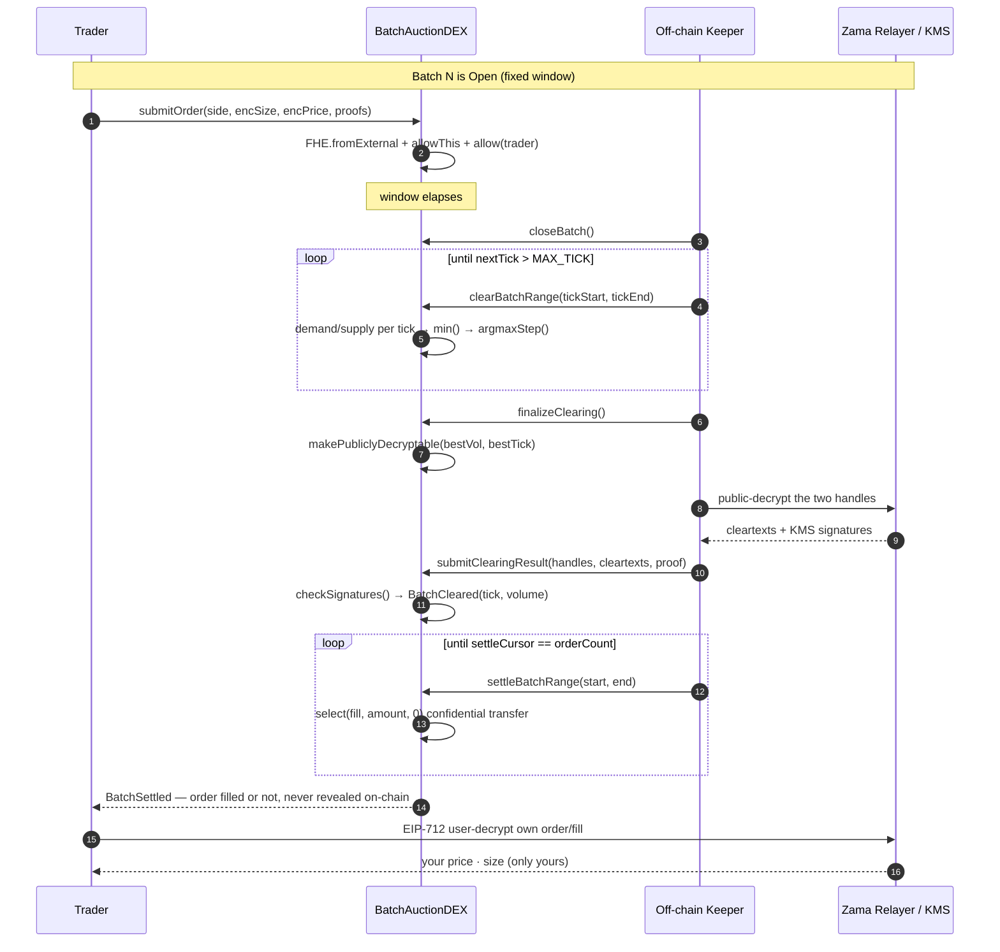
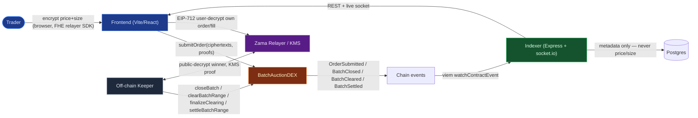

# CONCORD

## Introduction

Every order on a transparent DEX sits in the mempool before it executes. Searchers read it, front-run
it, sandwich it. The trader pays the MEV tax on every fill. A ZK proof can show your bid is valid — but
it cannot let a contract *clear a price across many hidden bids*. That's the gap Concord closes.

**Concord is a sealed-bid, uniform-price batch-auction DEX built on Zama's FHEVM.** Instead of a
continuous order book where every price is legible the instant it's submitted, Concord accumulates
**encrypted** limit orders for a fixed window, then computes a single **uniform clearing price** over
the entire sealed book — entirely under fully homomorphic encryption — before a single token moves.

Traders submit orders whose price and size are FHE ciphertexts (`euint64`); only the side (buy/sell) is
public. When the batch closes, the contract scans a discrete 32-tick price grid, folding encrypted
demand and supply into a running **argmax under FHE**, and reveals only the winning `(tick, volume)` —
never an individual order. Crossing orders then settle as confidential ERC-7984 transfers using a
`select(fill, amount, 0)` trick, so whether *any specific order* filled is never revealed on-chain
either. A keeper drives the whole multi-block lifecycle; a trader can decrypt only their own order or
fill, proven via EIP-712 user-decryption against Zama's relayer — and provably cannot decrypt anyone
else's.

It's a walled garden built for MEV to starve in: nothing readable ever touches the mempool, so there is
nothing to front-run.

Concord is the DEX where sealing your bid isn't a UI promise — it's **enforced on-chain by the coprocessor
before the proof of decryption is even accepted.**

Built for the **Zama Developer Program S3 — Builder Track**.

---

## Mathematical Visualization

### Per-batch lifecycle



### Worked clearing example (4 orders, toy grid)

For a candidate tick `t`, a **buy** contributes its full size to demand iff `limitPrice ≥ t`; a **sell**
contributes to supply iff `limitPrice ≤ t`. Matched volume at `t` is the short side:
`matched(t) = min(demand(t), supply(t))`. The clearing tick is the `t` that **maximizes** `matched(t)`.

| Tick | Demand (buys ≥ t) | Supply (sells ≤ t) | Matched = min(D, S) |
|---|---|---|---|
| 12 | 900 | 100 | 100 |
| 13 | 700 | 250 | 250 |
| 14 | 500 | 500 | **500** ← winner |
| 15 | 300 | 800 | 300 |
| 16 | 100 | 950 | 100 |

Clearing tick = **14**, matched volume = **500**. Every crossing order settles at tick 14 regardless of
its own limit — the uniform-price property. This whole table is computed **inside the FHE coprocessor**;
the chain only ever sees `(14, 500)` once `submitClearingResult` lands. No individual demand/supply
column, and no individual order, is ever decrypted.

This differs from a Vickrey/Shapley-style *payout-split* mechanism — Concord doesn't split value among
cooperating parties; it finds the single price that clears the most volume, the same objective a
classical continuous double auction targets, just computed over ciphertext instead of a public book.

---

## The Five States of a Batch

Concord has no agent swarm — the "cast" here is the batch's own lifecycle, driven end-to-end by one
permissioned keeper (`BatchAuctionDEX.onlyKeeper`) that anyone can audit against on-chain state.

### Open — accepting sealed orders

> *"Encrypt in the browser, submit a ciphertext, and no one — not even the keeper — can read it."*

Traders call `submitOrder(side, encSize, encPrice, sizeProof, priceProof)`. The DEX runs
`FHE.fromExternal` to admit the ciphertexts, then grants ACL with `FHE.allowThis` (the contract may
operate on them) and `FHE.allow(msg.sender)` (the trader may later decrypt their own). Only `OrderType`
is public.

### Closed — the encrypted clearing scan begins

> *"Order flow is frozen; nothing new can bias the price."*

`closeBatch()` seeds an encrypted running best `(bestVol=0, bestTick=0)` once the window has elapsed.
No more orders are accepted for this batch.

### Clearing — paginated argmax under FHE

> *"Scan the whole 32-tick grid, a handful of ticks per transaction, and never exceed the HCU budget."*

`clearBatchRange(tickStart, tickEnd)` folds a contiguous chunk of ticks into the running
`(bestVol, bestTick)`, persisting it between keeper transactions via `FHE.allowThis`. Once the full grid
is scanned, `finalizeClearing()` calls `FHE.makePubliclyDecryptable` on the two winning ciphertexts and
emits `ClearingPending` with their handles.

### Cleared — the winner, and only the winner, is plaintext

> *"The keeper decrypts off-chain via the relayer, and the contract verifies the KMS signed it before
> trusting a single bit."*

The keeper public-decrypts the two handles through Zama's relayer and calls `submitClearingResult`,
which calls `FHE.checkSignatures` against the KMS proof before writing `batch.clearingPrice` /
`batch.matchedVolume` and emitting `BatchCleared`.

### Settled — confidential transfers, no fill ever revealed

> *"Every order transfers on-chain. Whether it crossed is baked into the amount, not into a public flag."*

`settleBatchRange(start, end)` computes `ebool fill = shouldFillOrder(...)` and transfers
`FHE.select(fill, amount, 0)` for each order — a non-crossing order silently moves zero. Once every
order in the batch is processed, the batch flips to `Settled` and the next batch auto-opens.

---

## Key Features

- **Sealed submission**: price and size are FHE ciphertexts (`euint64`) before they ever touch the
  mempool — encrypted client-side in the browser via the Zama relayer SDK.
- **Uniform-price clearing under FHE**: one clearing tick per batch, computed by folding encrypted
  demand/supply into a running argmax — never a per-order comparison in plaintext.
- **Confidential settlement**: `FHE.select(fill, amount, 0)` means a fill decision is never a visible
  on-chain branch — every order transfers, filled or not.
- **Multi-block, HCU-bounded clearing**: `clearBatchRange` is paginated and content-independent, so a
  keeper transaction never exceeds the ~20M Homomorphic Complexity Unit budget regardless of grid size.
- **EIP-712 user-decryption**: a trader decrypts only their own order/fill; the on-chain ACL
  (`FHE.allow`) makes decrypting anyone else's provably fail — not a UI-level promise.
- **Keeper-driven async lifecycle**: `Open → Closed → Clearing → Cleared → Settled`, idempotent poll
  loop, safe to restart, every step independently verifiable on-chain.
- **Read-only, metadata-only indexer**: watches chain events into REST + socket.io; persists batch/order
  *metadata* (status, side, filled) — never price or size, which stay encrypted on-chain.
- **Parameterized price grid**: `TickMath.MAX_TICK`/`TICK_COUNT` are pure gas/precision knobs — 32 ticks
  today clears in ~6 keeper transactions; widening the grid needs no other contract change.

---

## Architecture & User Flow



Trader-facing state (batch status, side, fill flags, aggregate clearing price/volume) flows through the
indexer over REST + socket.io. Anything that would leak an individual order — price, size, whether a
*specific* order filled beyond the public aggregate — never leaves the chain in plaintext; it only ever
reaches a trader through their own EIP-712 user-decryption request against the relayer.

---

## How Concord Uses Zama FHEVM

Concord is built on `@fhevm/solidity` from the ground up — every ciphertext operation, every ACL grant,
and every decryption path goes through the FHE library directly against the real coprocessor.

### 1. Coprocessor wiring (`src/core/BatchAuctionDEX.sol`)

```solidity
import {FHE, euint64, ebool, externalEuint64} from "@fhevm/solidity/lib/FHE.sol";
import {ZamaConfig} from "@fhevm/solidity/config/ZamaConfig.sol";

constructor(...) {
    FHE.setCoprocessor(ZamaConfig.getEthereumCoprocessorConfig());
    ...
}
```

Every deployment points at Zama's real Ethereum coprocessor config — not a mock decrypt path.

### 2. Admitting external ciphertexts + ACL (`submitOrder`)

```solidity
euint64 size = FHE.fromExternal(encryptedSize, sizeProof);
euint64 limitPrice = FHE.fromExternal(encryptedPrice, priceProof);

FHE.allowThis(size);          // the contract may operate on it
FHE.allowThis(limitPrice);
FHE.allow(size, msg.sender);       // the trader may decrypt their own
FHE.allow(limitPrice, msg.sender);
```

Without `FHE.allow`, a trader's own order would be unreadable even to them — this is what makes
"decrypt my order, not anyone else's" an on-chain guarantee rather than a UI convention.

### 3. Encrypted primitives (`src/core/ClearingEngine.sol`)

```solidity
function _demandContribution(euint64 limit, euint64 size, euint64 tickEnc) internal returns (euint64) {
    ebool willBuy = FHE.ge(limit, tickEnc);
    return FHE.select(willBuy, size, FHE.asEuint64(0));
}
```

`FHE.ge`, `FHE.le`, `FHE.min`, `FHE.gt`, and `FHE.select` compose into the demand/supply/argmax scan —
every comparison and branch happens on ciphertext, so the tick loop's *content* never leaks through gas
usage or control flow (every candidate tick does the same fixed work).

### 4. Publishing only the winner for decryption

```solidity
FHE.makePubliclyDecryptable(vol);
FHE.makePubliclyDecryptable(tick);
emit ClearingPending(batchId, FHE.toBytes32(vol), FHE.toBytes32(tick));
```

Out of an entire encrypted order book, exactly two ciphertexts — the winning tick and its matched
volume — are ever marked decryptable. Every other value in the batch stays sealed forever.

### 5. Verifying the KMS proof before trusting plaintext

```solidity
FHE.checkSignatures(handles, cleartexts, decryptionProof);
(uint256 volume, uint256 tick) = abi.decode(cleartexts, (uint256, uint256));
```

The keeper cannot simply *claim* a clearing price — `checkSignatures` reverts unless Zama's KMS actually
signed that exact `(handles, cleartexts)` pair.

### 6. Confidential settlement (`select`, never a public branch)

```solidity
ebool fill = shouldFillOrder(isBuy, o.limitPrice, batches[o.batchId].clearingPrice);
euint64 baseAmt  = FHE.select(fill, o.size, FHE.asEuint64(0));
euint64 quoteAmt = FHE.select(fill, FHE.mul(o.size, priceEnc), FHE.asEuint64(0));
```

Both amounts are computed and both transfers execute for *every* order — a non-crossing order's
transfer just happens to move zero. There is no on-chain `if (filled)`, so gas usage and event shape
never leak a fill decision.

### 7. Confidential tokens (`src/tokens/ConfidentialToken.sol`)

A thin wrapper over OpenZeppelin's audited `ERC7984` confidential-token standard, plus a testnet
`mint`. Settlement moves value via `confidentialTransfer` / `confidentialTransferFrom` — the DEX is the
central counterparty and traders approve it as an ERC-7984 operator once.

---

## Mathematical Foundation

### The price grid (`src/libraries/TickMath.sol`)

```solidity
uint256 internal constant MIN_TICK = 0;
uint256 internal constant MAX_TICK = 31;          // 32 ticks total
uint256 internal constant MIN_PRICE = 1e16;        // $0.01, 18-decimal
uint256 internal constant TICK_SPACING = 1e17;     // $0.10 between ticks
uint256 internal constant MAX_PRICE = MIN_PRICE + (MAX_TICK * TICK_SPACING);
```

`MAX_PRICE` is **derived** from `(MIN_PRICE, TICK_SPACING, MAX_TICK)`, not set independently — so
`priceToTick(tickToPrice(t)) == t` for every valid tick, fuzz-tested in `test/unit/TickMath.t.sol`.
Grid width is purely a gas/precision knob: raising `MAX_TICK` widens price resolution and the keeper
simply folds more tick chunks per batch — the clearing math is content-independent, so nothing else in
the contract changes.

### The HCU/gas reality (why the grid is 32, not 1000)

Each candidate tick's demand/supply/argmax fold costs a fixed amount of Homomorphic Complexity Units
regardless of order count. Measured against the coprocessor's ~20M HCU-per-transaction budget, a keeper
transaction folds roughly 6 ticks with a handful of open orders:

| Grid size | Clearing txs / batch |
|---|---|
| **32 ticks (current)** | **~6** |
| 128 ticks | ~22 |
| 1000 ticks | ~167 |

`clearBatchRange(tickStart, tickEnd)` is how the contract survives this: it persists the running
`(bestVol, bestTick)` between transactions (`FHE.allowThis`), so the scan resumes exactly where the last
keeper call left off — `require(tickStart == batch.nextTick, ...)` enforces contiguity.

### Settlement's non-revelation property

For an order with limit `L` on the buy side, `shouldFillOrder` computes `ebool fill = FHE.ge(L,
clearingTick)` entirely in ciphertext. The transferred amount is then `FHE.select(fill, amount, 0)` —
algebraically, a non-fill is *indistinguishable on-chain* from a fill of size zero. The only way to learn
whether a specific order filled is to be that order's owner and decrypt `isOrderFilled` / the resulting
balance change yourself.

---

## Deployment

Network: **Ethereum Sepolia** with Zama's FHEVM coprocessor (`RPC_URL=https://sepolia.rpc.zama.ai`).

Contracts are not deployed to a fixed, permanent address — each deployment mints a fresh
`BatchAuctionDEX` + two `ConfidentialToken` legs. Run the deploy script and it prints the addresses to
wire into every `.env`:

```bash
cp .env.example .env      # PRIVATE_KEY, RPC_URL, ETHERSCAN_API_KEY
forge script script/Deploy.s.sol --rpc-url "$RPC_URL" --broadcast --verify
```

```
=== Deployment Summary ===
Base Token:  0x...
Quote Token: 0x...
DEX:         0x...
Batch Duration (s): 300
```

Copy those three addresses into `keeper/.env` (`DEX_ADDRESS`), `indexer/.env` (`DEX_ADDRESS`), and
`frontend/.env` (`VITE_DEX_ADDRESS`, `VITE_BASE_TOKEN`, `VITE_QUOTE_TOKEN`).

---

## 🚀 Quick Start

### Prerequisites

- [Foundry](https://book.getfoundry.sh/) (`forge`, `cast`)
- Node.js 18+
- Docker (for the keeper + indexer + observability stack)

### Contracts

```bash
forge build
forge test                # 11 tests, Foundry isolate mode (real per-tx HCU budgets)
forge test --gas-report
```

### Deploy (Sepolia + Zama FHEVM)

```bash
cp .env.example .env      # PRIVATE_KEY, RPC_URL, ETHERSCAN_API_KEY
forge script script/Deploy.s.sol --rpc-url "$RPC_URL" --broadcast --verify
```

### Keeper + indexer + observability

```bash
cp keeper/.env.example  keeper/.env    # KEEPER_PRIVATE_KEY, DEX_ADDRESS, RELAYER_URL
cp indexer/.env.example indexer/.env   # DEX_ADDRESS, RPC_URL
docker compose up --build              # postgres, keeper, indexer(:3001), prometheus(:9090), grafana(:3002)
```

### Frontend

```bash
cd frontend
cp .env.example .env      # VITE_DEX_ADDRESS, VITE_BASE_TOKEN, VITE_QUOTE_TOKEN, VITE_RELAYER_URL
npm install
npm run dev                # http://localhost:5173 → Connect, switch wallet to Sepolia
```

---

## How to test

```bash
# Contracts (Foundry)
forge test

# Frontend / keeper / indexer — no unit-test suites yet, typecheck only
cd frontend && npm run typecheck && cd ..
cd keeper   && npm run typecheck && cd ..
cd indexer  && npm run typecheck && cd ..
```

| Suite | Result |
|---|---|
| Foundry (`test/unit/*.t.sol`) | **11 / 11** passing (TickMath fuzz + full encrypted lifecycle) |
| Frontend / keeper / indexer | typecheck clean — no unit-test suites yet |

---

## Docs

| Doc | For |
|-----|-----|
| [`docs/SPEC.md`](./docs/SPEC.md) | The original spec / pitch brief |
| [`docs/BACKEND_AUDIT.md`](./docs/BACKEND_AUDIT.md) | Audit findings + contract behaviour |
| [`docs/FRONTEND_GUIDE.md`](./docs/FRONTEND_GUIDE.md) | Contract surface + encryption reference for frontend devs |
| [`docs/DEMO_SCRIPT.md`](./docs/DEMO_SCRIPT.md) | Recording run-of-show (deck + live app, beat-by-beat) |
| [`docs/Concord_Deck.pdf`](./docs/Concord_Deck.pdf) | 14-slide pitch deck |

## Layout

```
src/        Solidity contracts (BatchAuctionDEX, ClearingEngine, TickMath, ConfidentialToken)
test/       Foundry tests (TickMath fuzz + full encrypted lifecycle)
script/     Deploy.s.sol
keeper/     Off-chain lifecycle keeper (TypeScript/viem)
indexer/    Read-only event indexer — REST + socket.io (TypeScript/viem/Express)
frontend/   Trading UI — Vite/React/wagmi, client-side FHE encryption + EIP-712 decryption
infra/      Prometheus + Grafana provisioning (see docker-compose.yml)
docs/       Architecture, audit, frontend guide, demo script, pitch deck
```

---

## Development Team

- [@Sarnav07](https://github.com/Sarnav07)
- [@pranav7002](https://github.com/pranav7002)
- [@vihaan1016](https://github.com/vihaan1016)

---

## License

This project is licensed under the MIT License — see [`LICENSE`](./LICENSE).

---

**Concord — sealed by construction.**
